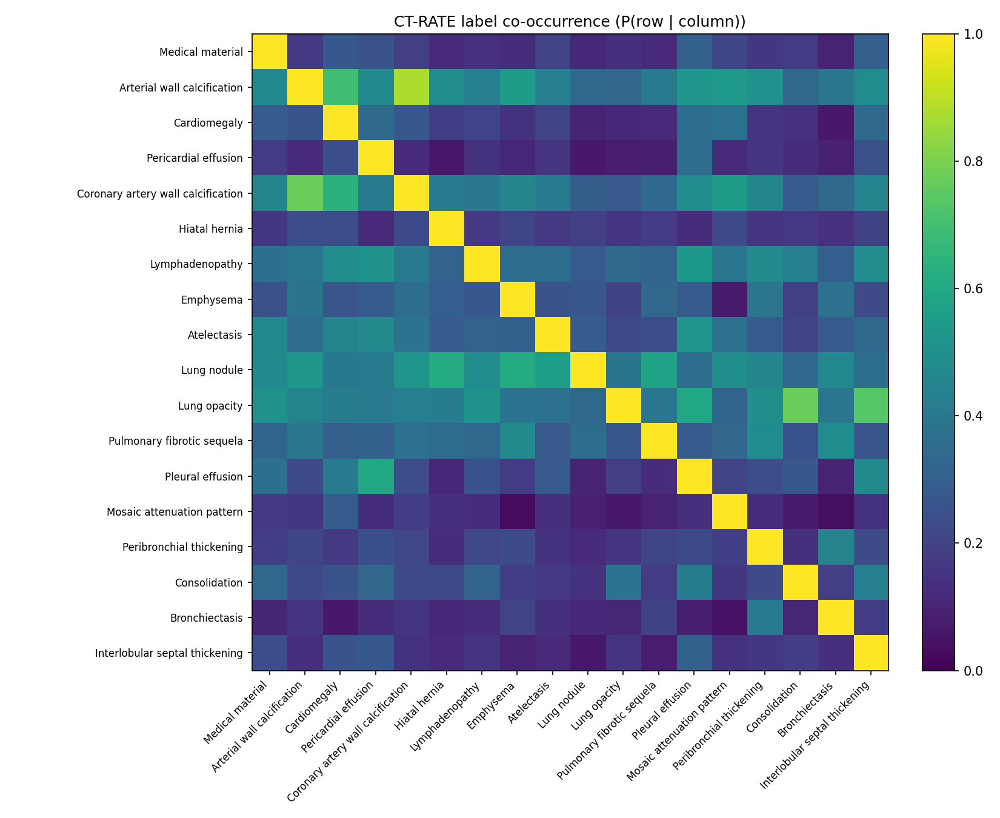
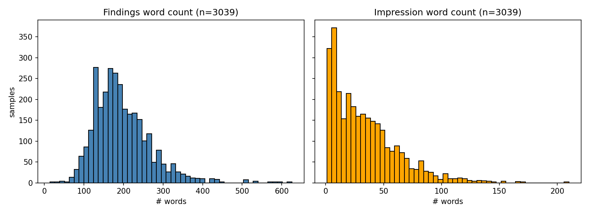
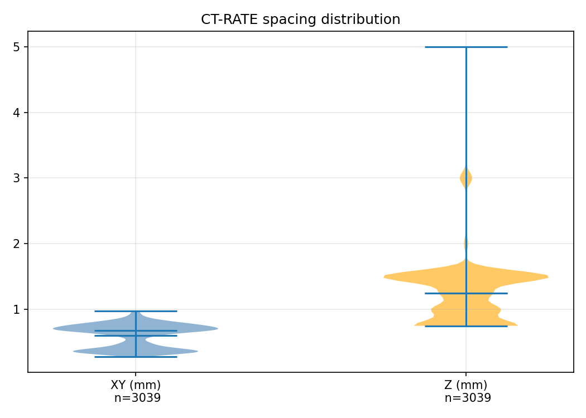
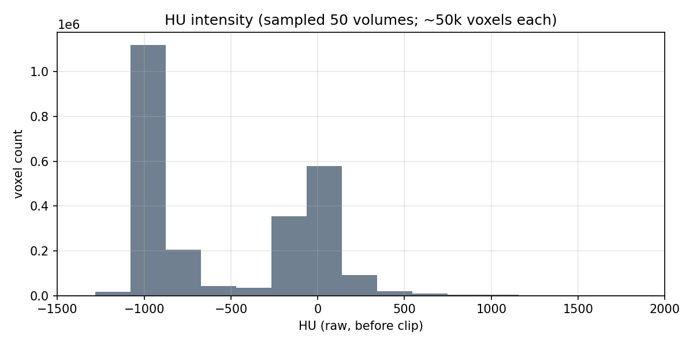

# VLM3D 2026 Project Guidebook

> Last updated: 2026-05-31 (Phase A 종료 직후). 코드/디렉토리 변경 시 이 문서도 같이 갱신해 주세요.

이 문서는 **(1) 프로젝트 코드 구조 투어**, **(2) 읽어야 할 파일을 우선순위 순으로 설명**, **(3) 데이터셋 통계 요약 + 그림 인용**, **(4) GenerateCT 출력 살펴보는 방법**, **(5) 자주 쓰는 명령**을 한 곳에 모은 가이드북입니다. 처음 본 사람이 위에서부터 따라가면 어디가 무엇인지 파악하고 다음 작업을 시작할 수 있게 구성했어요.

---

## 0. TL;DR — 무엇을 하는 프로젝트인가

**목표**: MICCAI VLM3D 2026 Task 4 (Text-Conditional CT Generation) 챌린지에 제출하고, 작년 1위 **Report2CT**를 metric에서 이긴다.

**Pipeline (목표 형태)**

```
radiology report (findings + impression) + voxel spacing
  → 3 text encoders (HF) → 2 × 2560 cond tensor
  → DiffusionModelUNetMaisi (cross-attn at last 2 levels, dim 2560)
  → MAISI VAE decoder (frozen)
  → CT volume [1, 480, 480, 256]
```

**제출 마감**: 2026-08-20. Phase A 완료(5/31). Phase B 시작 6/1.

**Win condition**: VLM3D-Dockers로 측정한 CT-RATE valid 1000-split에서 `ours_final`이 `report2ct_our_repro` 대비 `{FID_2p5D_Avg, CLIPScore, FVD_CTNet}` 중 2개 이상에서 이긴다. 우선 metric: **2.5D-FID > CLIPScore-T2I > FVD**.

전체 의사결정 흐름은 `.omc/specs/deep-interview-vlm3d-pivot.md`에 8라운드 deep-interview로 기록되어 있고, 실행 계획은 `.omc/plans/vlm3d-pivot-plan.md`에 3-iteration consensus로 정돈되어 있습니다.

---

## 1. 처음 30분 권장 코스 (읽기만)

다음 순서로 읽으면 프로젝트 전체를 파악할 수 있습니다.

| # | 파일 | 왜 | 분량 |
|---|---|---|---|
| 1 | `CLAUDE.md` | 프로젝트 한 페이지 요약 (목표 / 환경 / repo layout / win condition / non-goals) | 5분 |
| 2 | `GUIDE.md` (이 파일) | 코드와 데이터셋을 어디서부터 봐야 할지 | 10분 |
| 3 | `.omc/specs/deep-interview-vlm3d-pivot.md` | 왜 triplane 폐기 / 왜 Report2CT 재구현인지 의사결정 트레일 | 10분 |
| 4 | `figs/eda/*.png` | 데이터셋이 어떻게 생겼는지 (4 figures + summary in §3) | 5분 |

---

## 2. Repo 구조 투어

```
.
├── CLAUDE.md                       # 프로젝트 한 페이지 요약 (claude/사람 모두 읽음)
├── GUIDE.md                        # 이 가이드
├── README.md                       # template README (보지 마세요; lightning-hydra-template 원본)
├── Makefile, setup.py, pyproject.toml, environment.yaml, requirements.txt
│
├── src/                            # 우리 코드 (lightning-hydra-template base + 우리 추가)
│   ├── train.py, eval.py           # Hydra @main entrypoint (template 그대로)
│   ├── data/
│   │   ├── ct_rate_datamodule.py   # ★ CT-RATE LightningDataModule (3,039 valid samples)
│   │   ├── ct_rate_eda.py          # 4종 EDA helper
│   │   └── (template mnist/components — 우리 안 씀)
│   ├── models/                     # 우리 모델 v1 lands Phase C (현재 비어있음)
│   ├── baselines/
│   │   ├── maisi.py                # ★ MAISI VAE 동결 loader (bundle config 그대로 사용)
│   │   ├── generatect_adapter.py   # ★ GenerateCT LightningModule wrapper
│   │   └── report2ct_adapter.py    # ★ Report2CT UNet skeleton (DiffusionModelUNetMaisi 233M)
│   ├── diagnostics/                # 4종 진단 모듈 — Phase B에서 채워짐
│   ├── vlm3d_runner.py             # ★ VLM3D-Dockers ctgen 평가 subprocess wrapper
│   └── utils/                      # template 보일러플레이트 (logging/rich/instantiators)
│
├── configs/                        # Hydra 계층 (template 구조)
│   ├── train.yaml, eval.yaml       # root configs
│   ├── data/, model/, trainer/, logger/, callbacks/, experiment/, ...
│   └── experiment/example.yaml     # 우리 첫 experiment template (report2ct_repro.yaml lands Phase B)
│
├── tests/                          # pytest 18 passed / 2 skipped
│   ├── test_hydra_compose.py       # `train.py --cfg job --resolve` exits 0
│   ├── test_data_module.py         # CT-RATE DM smoke (3039 valid, spacing parse, ...)
│   ├── test_maisi_frozen_load.py   # ★ R6 mitigation: MAISI 동결 검증
│   ├── test_generatect_adapter.py  # ★ sys.path import + ckpt load
│   ├── test_report2ct_module.py    # ★ DiffusionModelUNetMaisi 1-step forward
│   ├── test_lightning_fit_smoke.py # ★ Trainer.fit max_steps=1 end-to-end proof
│   ├── test_diagnostic_cross_attn_generatect_smoke.py  # Phase B (slip-eligible)
│   └── (template tests 일부 — pkg_resources 의존이라 disable)
│
├── third_party/                    # READ-ONLY 외부 코드 (Principle P2)
│   ├── report2ct/        SHA 7b483a8  GitHub: sinaamirrajab/report2ct
│   ├── generatect/       SHA 2a81135  GitHub: ibrahimethemhamamci/GenerateCT
│   ├── vlm3d_dockers/    SHA c73fe07  GitHub: forithmus/VLM3D-Dockers
│   └── maisi_bundle/                  MONAI MAISI bundle (vendored)
│
├── submission/                     # Phase A stub → Phase D 제출본 (P3 hard contract)
│   ├── process.py, Dockerfile, build.sh, test.sh, test_local.sh, export.sh
│   ├── README.md, requirements.txt
│   └── test/prompts.json           # 5-prompt fixture from CT-RATE valid reports
│
├── docs/                           # 개발자용 reference docs
│   ├── submodule_pins.md           # 3 submodule SHA pin
│   ├── ct_clip_check.md            # R5 mitigation: CT-CLIP 가용성 확인 (CC-BY-NC-SA)
│   ├── report2ct_external_components.md  # 3 text encoder HF id 핀
│   └── report2ct_training_handoff.md     # Phase B kickoff 사용자 runbook
│
├── .omc/                           # 의사결정 + 계획 artifacts (git-tracked since d1fba5b)
│   ├── specs/
│   │   └── deep-interview-vlm3d-pivot.md   # 8라운드 deep-interview (22% ambiguity, PASSED)
│   └── plans/
│       ├── vlm3d-pivot-plan.md             # 3-iteration consensus (Critic APPROVED)
│       ├── report2ct_impl_spec.md          # paper read + submodule wrap strategy
│       └── report2ct_envelope.md           # 3-TE-cfg-mid anchor (markdown form)
│
├── scripts/                        # 실행 가능한 entry-style 스크립트
│   └── run_eda.py                  # python scripts/run_eda.py --split valid --hu-sample 50
│
├── notebooks/
│   └── eda.ipynb                   # 4종 EDA orchestrator (thin wrapper)
│
├── figs/eda/                       # Phase A Day 4 EDA 산출물 (4 PNGs)
│   ├── label_cooccurrence.png      # 18 × 18 abnormality heatmap
│   ├── report_token_len.png        # findings + impression word count histogram
│   ├── spacing_violin.png          # XY + Z mm distribution
│   └── hu_histogram.png            # HU intensity from 50 sampled volumes
│
├── results/                        # 영구 결과 + 단일 source-of-truth JSONs
│   ├── upper_bound.json            # MAISI VAE round-trip baseline: PSNR 30.94 dB
│   └── report2ct_envelope.json     # ★ 우리 win 기준의 numerical lock
│
├── data/                           # 새 artifacts (read-write)
│   └── checkpoints/generatect/{ctvit, transformer, superres}_pretrained.pt  (gitignored, ~1.5GB)
│
├── datasets/                       # ☝️ READ-ONLY collaborator 데이터 (절대 쓰지 말 것)
│   └── datasets/CT-RATE/dataset/{train_fixed,valid_fixed,metadata,radiology_text_reports,...}
│
├── paper_pdf/                      # 참고 논문 (Report2CT, GenerateCT, MAISI, ...)
│
└── deprecated/                     # 모든 triplane-era 작업 (import 금지)
    ├── triplane_src/, triplane_configs/, triplane_runs/, triplane_tests/
    ├── reference_old/, research_summary_old/, analysis_old/
    ├── scripts_old/, wandb_old/, results_old/
    └── old_artifacts/  (옛 data/latents_2mm + maisi_latent_with_recon)
```

★ 표시 = 우리가 직접 짠 핵심 파일.

---

## 3. 데이터셋 통계 (CT-RATE valid)

`figs/eda/`에 4개 figure로 시각화되어 있어요. 핵심 발견을 인용해 둡니다 (Day 4 EOD `scripts/run_eda.py` 출력).

### 3.1 라벨 co-occurrence (`figs/eda/label_cooccurrence.png`)



- 18개 abnormality 라벨 사이의 조건부확률 P(row | column) heatmap.
- 대각선이 1 (자기 자신).
- 우리가 활용할 신호: Lung opacity ↔ Consolidation, Cardiomegaly ↔ Pleural effusion 같은 임상적으로 co-occur하는 짝들이 보임. Phase B counterfactual diagnostic에서 "pneumonia 제거" 같은 단일-라벨 perturbation의 효과를 검증할 때 이 분포를 참고.

### 3.2 Report 단어 수 분포 (`figs/eda/report_token_len.png`)



| Section | 중위수 | p95 | 최대 |
|---|---|---|---|
| Findings | 184 단어 | 329 | 626 |
| Impressions | 28 단어 | 88 | 210 |

**의미**: Findings가 Impressions보다 약 6.5배 길다. Report2CT가 두 섹션을 **별도로** encode하고 cross-attn에 concat하는 설계가 정당화됨 — 길이 차이가 커서 단순 concat 후 single-pool은 짧은 Impression 정보가 묻힐 위험.

### 3.3 Spacing 분포 (`figs/eda/spacing_violin.png`)



| 축 | 중위수 | p5–p95 |
|---|---|---|
| XY | 0.68 mm | [0.34, 0.83] |
| Z | 1.25 mm | [0.75, 1.50] |

**의미**: anisotropic (XY ≠ Z). Report2CT가 voxel spacing을 conditioning input으로 받는 이유. 우리 모델도 spacing-conditioning을 keep해야 함.

### 3.4 HU intensity (`figs/eda/hu_histogram.png`)



50개 volume에서 ~50,000 voxel씩 샘플링한 분포.

| 통계 | 값 |
|---|---|
| 중위수 voxel HU | -825 |
| p5–p95 | [-1024, 146] |

**의미**: lung CT답게 air-dominated. Report2CT/우리 모델 모두 HU clip `[-1000, 1000]` → `[0, 1]` 정규화. Dynamic range의 대부분이 air-tissue interface에 집중되어 있어, FID 계산 시 정규화 일관성이 중요.

### 3.5 데이터 위치 (절대로 쓰지 말 것 — read-only)

| Path | 용도 |
|---|---|
| `/workspace/datasets/datasets/CT-RATE/dataset/valid_fixed/<patient>/<study>/<volume>.nii.gz` | NIfTI 볼륨 (1,304 patients, 3,038 valid scans) |
| `…/train_fixed/…` | 학습용 (20,000 patients, 47,148 scans) |
| `…/radiology_text_reports/validation_reports.csv` | VolumeName + Findings_EN + Impressions_EN |
| `…/metadata/validation_metadata.csv` | spacing, manufacturer, kernel, ... |
| `…/multi_abnormality_labels/valid_predicted_labels.csv` | 18 binary labels per scan |

새 캐시/derivative artifact는 모두 `/workspace/data/` 아래로.

---

## 4. 코드 모듈별 해설 (읽는 순서 추천)

### 4.1 `src/baselines/maisi.py` — MAISI VAE frozen loader

**한 줄 요약**: bundle config 그대로 읽어서 frozen autoencoder 반환. 모든 곳에서 이걸로 MAISI 로드.

```python
from src.baselines.maisi import load_frozen
vae = load_frozen(device="cuda:0")  # 모든 param requires_grad=False, .eval() 상태
```

**구현 포인트**:
- `monai.bundle.ConfigParser`로 `third_party/maisi_bundle/configs/inference.json`의 `autoencoder_def` 블록을 그대로 instantiate. **우리가 architecture kwargs를 한 줄도 안 적었음** (중복 0).
- `is_fully_frozen(model)` helper로 모든 param이 frozen인지 확인 가능. Tests/test_maisi_frozen_load.py가 이걸 검증.
- 왜 이렇게 했나: Day 2에 처음엔 inference.json의 kwargs를 hardcode했다가 user가 "bundle 그대로 쓰면 되지 않냐" 지적해서 refactor. 같은 reuse-first 원칙을 Report2CT adapter에도 적용.

**연관 파일**: `tests/test_maisi_frozen_load.py` (R6 검증).

### 4.2 `src/baselines/report2ct_adapter.py` — Report2CT UNet 스켈레톤

**한 줄 요약**: submodule의 model definition JSON 그대로 instantiate해서 DiffusionModelUNetMaisi(233M)를 forward할 수 있는 LightningModule shell.

```python
from src.baselines.report2ct_adapter import build_unet, forward_one_step
unet = build_unet()  # 233M params, no weights (Report2CT는 weight 미공개)
out = forward_one_step(unet, latent, context, spacing, timestep=500, class_label=1)
# out.shape == latent.shape  (예: (1, 4, 16, 16, 8))
```

**구현 포인트**:
- `ConfigParser`로 `third_party/report2ct/vlm3D_work_dir/config_maisi_2560.json`의 `diffusion_unet_def` 블록을 그대로 사용. 다시 0 중복.
- Forward signature: `x, timesteps, context, class_labels, spacing_tensor`. class_labels 강제 (config에 `num_class_embeds: 128`).
- LightningModule shell만 (training_step은 비어있음). 학습 자체는 Phase B에서 submodule의 `diff_model_train_vlm3D_2560_multi_text.py`를 subprocess로 invoke. [[report2ct-training-is-user-owned]] 정책.

**왜 이걸 처음부터 짜지 않았나**: Report2CT submodule이 학습 code + JSON config + train.sh를 모두 공개. weights만 없음. 그래서 우리는 **wrap만** 하면 됨. 직접 PyTorch 구현 X.

### 4.3 `src/baselines/generatect_adapter.py` — GenerateCT 텍스트→볼륨

**한 줄 요약**: `sys.path` 추가로 transformer_maskgit 가져오고 CTViT + MaskGITTransformer를 paper kwargs로 빌드. 3 pretrained ckpt 로드.

```python
from src.baselines.generatect_adapter import GenerateCTAdapter
adapter = GenerateCTAdapter(device_str="cuda:0")
volume = adapter.text_to_volume("Findings consistent with viral pneumonia in both lungs.")
# volume: (1, 1, ~201, 128, 128) low-res; super-res는 Phase B에 추가
```

**구현 포인트**:
- `sys.path.insert(0, "third_party/generatect/transformer_maskgit")` 로 setup.py 실행 없이 import 가능. 사용자 명시적 승인 받음.
- **DUPLICATION INTENTIONAL annotation**이 `_CTVIT_KWARGS` / `_MASKGIT_KWARGS` 위에 달려 있어요 — GenerateCT submodule은 paper 설정을 Python script literal로만 보관, JSON/YAML 없음. inference_ctvit.py:5-15 / inference_transformer.py:44-54 에서 복사.
- `text_to_volume()`은 `MaskGITTransformer.sample()`을 호출. CUDA 요구되니 dev container에서 실제 inference는 GPU 필요 (`device_str="cuda:0"`로 override).

### 4.4 `src/data/ct_rate_datamodule.py` — CT-RATE LightningDataModule

**한 줄 요약**: 3개 CSV (reports + metadata + labels)를 VolumeName 키로 join해서 `CTRateRecord` dataclass 리스트로 반환.

```python
from src.data.ct_rate_datamodule import CTRateDataModule, load_records

# 가볍게 메타데이터만 (NIfTI 안 읽음):
records = load_records("valid")  # 3,039개
r = records[0]
# r.volume_name='valid_1_a_1.nii.gz', r.nifti_path, r.findings, r.impression,
# r.spacing_xy=0.341, r.spacing_z=1.5, r.labels={'Cardiomegaly': 0, ...}

dm = CTRateDataModule(mode="metadata", num_workers=0, batch_size=4)
dm.setup()
batch = next(iter(dm.val_dataloader()))  # list[CTRateRecord] of len=4
```

**구현 포인트**:
- `_parse_spacing()` 헬퍼가 CT-RATE의 stringified-list spacing 셀 (`"[0.34, 0.34]"`)을 처리. Day 2에 실제 데이터 만져보면서 발견한 엣지케이스.
- `_resolve_nifti_path("valid_1_a_1.nii.gz", split_dir)` → `split_dir/valid_1/valid_1_a/valid_1_a_1.nii.gz` 경로 해결.
- `mode="metadata"` (현재)는 NIfTI 안 읽음 → EDA 빠름. `mode="volume"`은 Phase C에 추가 (현재 `NotImplementedError`).

**연관**: `src/data/ct_rate_eda.py` (4개 figure 생성 helpers), `scripts/run_eda.py` (실행).

### 4.5 `src/vlm3d_runner.py` — VLM3D-Dockers 평가 wrapper

**한 줄 요약**: ctgen_evaluation docker를 subprocess로 invoke (혹은 docker 없으면 NaN placeholder로 schema validate).

```bash
# Docker daemon 사용 가능 시:
python -m src.vlm3d_runner --predictions data/ours_v1/predictions/ --out results/vlm3d/ours_v1/metrics.json

# Docker daemon 없을 때 (dev container):
python -m src.vlm3d_runner --dry-run --out /tmp/smoke.json
# → {"FVD_CTNet": NaN, "CLIPScore": NaN, ...} 8 keys
```

**구현 포인트**:
- `docker_available()` 체크 → 없으면 `--dry-run` mode로 자동 fallback.
- Schema validation: VLM3D-Dockers의 8 metric key가 모두 있는지 `validate_metrics()` 체크.
- Phase D에서 실제 docker run으로 사용. Phase A/B에서는 fallback dry-run으로 downstream compare 파이프라인을 미리 시험.

### 4.6 `submission/` — Phase A stub → Phase D 제출본

**한 줄 요약**: VLM3D-Dockers ctgen contract 그대로 따르는 docker. 현재는 zero volume placeholder, Phase D에 우리 모델로 교체.

```bash
bash submission/test_local.sh   # docker 없이 local Python으로 contract 검증 (Phase A acceptance)
bash submission/test.sh         # docker 빌드 + run (Phase D)
bash submission/export.sh       # docker save | gzip 제출 archive
```

**파일 역할**:
- `process.py` — `/input/<x>.json` 읽어서 `/output/<name>.mha` (512×512×256 int16, HU range, 1mm isotropic) + `predictions.zip` 생성. 지금은 `generate_volume()`이 zeros + noise 반환. Phase D에 `ours/final/best.ckpt` 로드 + 샘플링으로 교체.
- `Dockerfile` — python:3.12-slim base, numpy + SimpleITK만.
- `test/prompts.json` — CT-RATE valid reports에서 추린 5-prompt fixture.

### 4.7 `tests/` — pytest 가이드

각 test 파일이 무엇을 검증하는지:

| 파일 | 검증 | Day |
|---|---|---|
| `test_hydra_compose.py` | `python src/train.py --cfg job --resolve` exits 0 (root config 결합 가능) | 1 |
| `test_data_module.py` | CT-RATE DM smoke: spacing parse, 3039 valid 로드, 배치 yield | 2 |
| `test_maisi_frozen_load.py` | ★ R6: MAISI ckpt 로드 + 모든 param `requires_grad=False` | 2 |
| `test_generatect_adapter.py` | sys.path import + CTViT 생성 (no/with weights) + ckpt 파일 존재 | 3 |
| `test_report2ct_module.py` | DiffusionModelUNetMaisi 빌드 + 1-step forward shape invariance | 4 |
| `test_lightning_fit_smoke.py` | `Trainer.fit(max_steps=1)` end-to-end on dummy LightningModule | 5 |
| `test_diagnostic_cross_attn_generatect_smoke.py` | (skip) Phase B 6/1로 미뤄짐 | (B) |

전체 실행:
```bash
pytest tests/ --ignore=tests/test_configs.py --ignore=tests/test_datamodules.py \
  --ignore=tests/test_eval.py --ignore=tests/test_sweeps.py --ignore=tests/test_train.py \
  --ignore=tests/helpers
# 현재: 18 passed, 2 skipped
```

(template 자체 test 5개는 pkg_resources 의존이라 disable. 우리 코드만 검증.)

---

## 5. GenerateCT 출력 보기

**현재 상태**: 3개 pretrained ckpt (~1.5GB)가 `data/checkpoints/generatect/`에 다운로드되어 있고 adapter (`src/baselines/generatect_adapter.py`)도 작동. **그러나 MaskGITTransformer가 `.cuda()`를 강제**하기 때문에 dev container 안에서 inference는 GPU가 필요해요.

### 옵션 A — GPU 한 장 잡고 1샘플 inference (~5분, 저해상도 128³)

```python
# python REPL or notebook
import torch
from src.baselines.generatect_adapter import GenerateCTAdapter

adapter = GenerateCTAdapter(device_str="cuda:0", load_super_resolution=False)
prompt = "Findings consistent with viral pneumonia in both lungs. Ground-glass opacities."
volume = adapter.text_to_volume(prompt)
print(volume.shape)   # 대략 (1, 1, 201, 128, 128) low-res
```

저장 후 슬라이스 보기:
```python
import nibabel as nib, numpy as np
vol = volume.squeeze().cpu().numpy()  # (D, H, W)
nib.save(nib.Nifti1Image(vol, np.eye(4)), "/workspace/data/generatect_smoke.nii.gz")
# Then: ITK-SNAP / 3D Slicer / nibabel 직접 보기
```

### 옵션 B — VLM3D-Dockers의 example_docker 그대로 사용 (full pipeline 512×512)

```bash
cd /workspace/third_party/vlm3d_dockers/ctgen_example_docker
bash test.sh   # 빌드 + 5-prompt 샘플 inference → exported_images/
```

이건 docker daemon이 필요하고 full super-res까지 도는 무거운 경로 (~30분/샘플 on A100, 더 오래 on A6000). Phase B B.3 진단에서 한 번 돌릴 예정.

### 옵션 C — 우리 stub submission 출력 보기 (Phase A 산출물)

```bash
bash /workspace/submission/test_local.sh
# /tmp/submission_test_out/predictions.zip 안에 5개 .mha (zeros + noise)
# 의미 있는 이미지 아님 — 단지 contract 검증용
```

---

## 6. 자주 쓰는 명령어 모음

### 환경 확인
```bash
python -c "import lightning, hydra, monai, diffusers, transformers; print('OK')"
```

### Hydra config compose 검증
```bash
python src/train.py --cfg job --resolve   # 우리 root config tree 확인
python src/eval.py --cfg job --resolve
```

### EDA 다시 돌리기
```bash
python scripts/run_eda.py --split valid --hu-sample 50
# figs/eda/{label_cooccurrence,report_token_len,spacing_violin,hu_histogram}.png 갱신
```

### 전체 pytest
```bash
pytest tests/ --ignore=tests/test_configs.py --ignore=tests/test_datamodules.py \
  --ignore=tests/test_eval.py --ignore=tests/test_sweeps.py --ignore=tests/test_train.py \
  --ignore=tests/helpers
```

### MAISI VAE 1샘플 로드 (다른 모듈에서 reuse 패턴)
```python
from src.baselines.maisi import load_frozen
vae = load_frozen(device="cuda:0")
# 인코드: latent = vae.encode(volume)  ←  Phase B/C에 사용
```

### Submission stub 검증
```bash
bash submission/test_local.sh
```

### VLM3D dry-run
```bash
python -m src.vlm3d_runner --dry-run --out /tmp/smoke.json
cat /tmp/smoke.json
```

---

## 7. Phase plan 요약

| Phase | 기간 | 주요 산출물 | 상태 |
|---|---|---|---|
| A | 5/26 → 5/31 (5d) | repo restructure, EDA, GenerateCT inference 준비, Report2CT 1-step gate, stub submission, envelope lock | ✅ 완료 |
| B | 6/1 → 6/30 (4w) | Report2CT 학습-ready code ([U]가 학습), 4종 diagnostic, VLM3D eval baseline 둘 다, 우리 v1 설계 | 시작 6/1 |
| C | 7/1 → 7/31 (4w) | 우리 모델 v1 학습 + ablation + 진단 | — |
| D | 8/1 → 8/20 (3w) | final 학습 + submission docker + writeup + 제출 | — |

Phase A 동안의 상세 의사결정은 `.omc/plans/vlm3d-pivot-plan.md` Phase A 섹션 + 4 commits (`d00ce71`, `16d10ac`, `6d0a12e`, `5675089`, `5908c84`)에 있습니다.

---

## 8. 다음에 무엇을 하면 좋은가 (Phase B Day 1, 6/1)

[A] Assistant-owned (assistant가 하는 일):
1. `scripts/precompute_report2ct_text_embeddings.py` — `vlm3d_inference.ipynb` cell 0의 3 text encoder 로딩 + CT-RATE 전체 report → `*multi_2560.json` 파일.
2. `scripts/precompute_report2ct_image_embeddings.py` — submodule의 `vlm3d_image_embedding.py`를 invoke (MAISI frozen 사용).
3. `configs/experiment/report2ct_repro.yaml` + `scripts/run_report2ct_training.sh` — Hydra-wrap된 launcher.
4. `docs/diagnostic_baseline_compatibility.md` — 4 진단 × 2 baseline 호환성 표.
5. (slip-eligible) Cross-attn GenerateCT smoke 활성화.
6. **6/1 compute-measurement gate**: 1-epoch wall-clock on 100-sample subset → `.omc/plans/phase_b_budget.md`.

[U] User-owned (사용자가 직접):
- `bash scripts/run_report2ct_training.sh` 실행 (multi-day).
- 결과 `results/report2ct_sanity.json` 채우기.

---

## 9. 약속한 컨벤션 (메모리에도 저장됨)

| 항목 | 출처 |
|---|---|
| **품질 > 일정 슬립** — 깨끗한 코드가 default | feedback memory `[[user-prefers-quality-over-schedule]]` |
| **Report2CT 학습은 [U]가 직접** | project memory `[[report2ct-training-is-user-owned]]` |
| **Triplane 잠정 폐기** — `deprecated/`에서만 참조 | project memory `[[triplane-deprecated-2026-05]]` |
| **third_party/ 는 read-only** — 수정 금지 (Principle P2) | plan §2 |
| **외부 코드 reuse 우선** — adapter로 감싸고 코드 새로 안 짬 | user 지시 2026-05-26 |
| **`CUDA_VISIBLE_DEVICES=0` 단일-GPU prefix** | CLAUDE.md |
| **데이터 위치**: 새 artifact → `/workspace/data/`; collaborator → `/workspace/datasets/` (read-only) | CLAUDE.md |

---

## 부록: 참고용 외부 링크

- Report2CT 논문: `paper_pdf/Report2CT.pdf` (14 페이지)
- GenerateCT 논문: `paper_pdf/GenerateCT.pdf` (ECCV 2024)
- MAISI 논문: `paper_pdf/MAISI.pdf` (WACV 2025)
- VLM3D 챌린지 사이트: ctgen.vlm3dchallenge.com
- lightning-hydra-template: github.com/ashleve/lightning-hydra-template

---

질문이 더 있으면 — 이 가이드에서 다루지 않은 모듈/결정/명령이 있으면 알려주세요. 부족한 부분은 이 문서에 추가하겠습니다.
